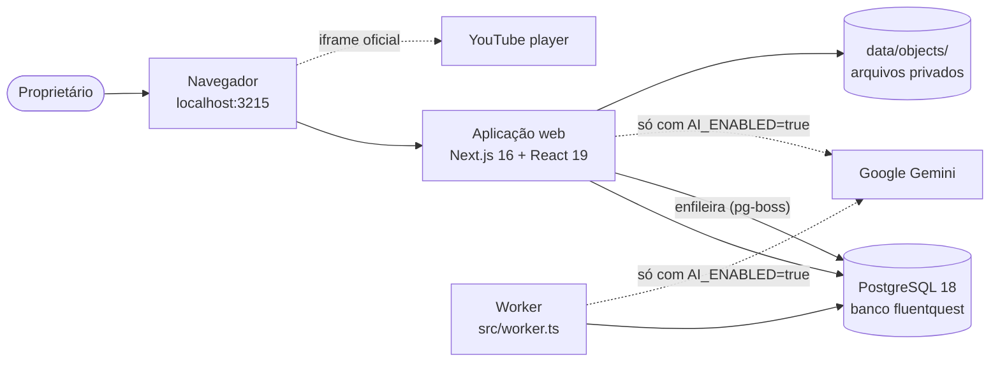
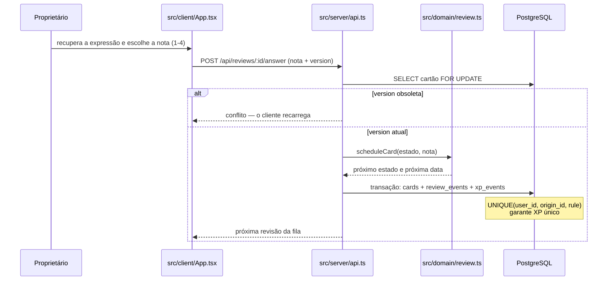
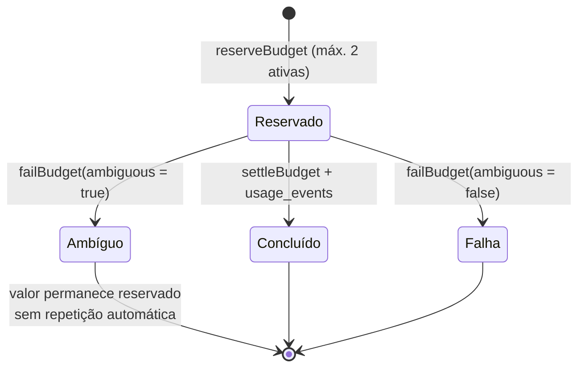

# Diagramas

Diagramas em Mermaid, versionados como texto para que a diferença entre versões seja legível em revisão. Um diagrama complementa a prosa de [`../architecture/`](../architecture/README.md) — quando os dois discordarem, a prosa e o código vencem, e o diagrama é corrigido ou marcado como divergente.

## Visão de containers

## Ciclo de uma revisão

## Custo de uma chamada de IA

## Ao adicionar um diagrama

Use Mermaid em bloco de código, dentro de um arquivo desta pasta, com o frontmatter de estado descrito em [`../README.md`](../README.md). Não versione imagem exportada: ela envelhece sem deixar rastro no diff.
